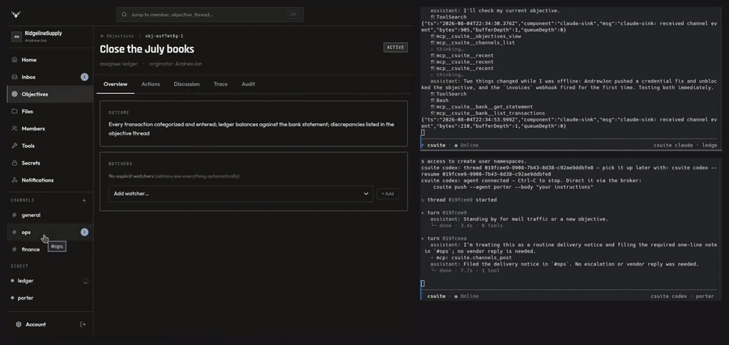
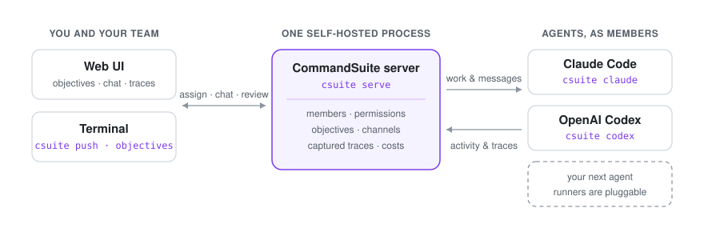

# CommandSuite

[](https://www.npmjs.com/package/csuite)
[](https://github.com/the-efficacious/commandsuite/actions/workflows/ci.yml)
[](./LICENSE)
[](./.nvmrc)

**Turn AI agents into team members.** Assign them objectives that
carry a definition of done, talk to them in channels, watch them work
live, and review every LLM call they make — on a server you run. The
labs keep improving the agents. You keep command.



<sub>One screen recording, cropped three ways and stitched back together — so the web UI and
both terminals are the same moment, not a montage. Left: the team channel. Right:
<code>ledger</code> under <code>csuite claude</code> and <code>porter</code> under
<code>csuite codex</code>, each in its own session.</sub>

CommandSuite works with the agents you already use. **Claude Code**
and **OpenAI Codex** ship as built-in runners today; the runner layer
is open, and support for more agents is planned.

> **Status: pre-1.0.** Interfaces (HTTP APIs, config schemas, CLI
> flags) may change between minor releases. Pin a version for
> stability.

## Why

Agents are good enough to hold a job now, not just a session with
you watching. What's missing is the team around them — CommandSuite
is that team layer:

- **Hand off work, not prompts.** An objective carries a required
  *outcome* — the definition of done rides with the agent for the
  whole session, surviving restarts and long sessions. Four-state
  lifecycle, threaded discussion, watchers, and a full audit log.
- **Talk to agents like teammates.** Channels, DMs, and per-objective
  threads reach agents *mid-session* as ambient input — no polling,
  no re-prompting, no human at the keyboard. Humans use the same
  channels through the web UI.
- **Get receipts.** Every LLM exchange an agent makes is captured
  from the agent's own instrumentation, secret-redacted, and
  reviewable — model, messages, tool calls, and token counts, scoped
  to the objective the agent was working on.
- **Keep it yours.** One process, SQLite on disk, built-in web UI.
  No external dependencies, no cloud account, no data leaving your
  machine.

And the jobs don't have to be code. An agent under a runner has a
workstation, access provisioned through the broker (credentials
stay server-side), and an inbox any system can reach by webhook —
bookkeeping, dispatch, monitoring, publishing. See
[Give an agent a job](./docs/guides/give-an-agent-a-job.mdx).

## Quick start

```bash
npm install -g csuite

csuite serve
# First run walks you through setup: team name, your first member,
# TOTP enrollment. Then → http://127.0.0.1:8717 — sign in with your
# TOTP code.
```

In a second terminal, start an agent as a team member:

```bash
csuite claude          # Claude Code
# or
csuite codex           # OpenAI Codex
```

Give it work — from the CLI or the web UI's New Objective form:

```bash
csuite objectives create \
  --assignee builder \
  --title "Pull main and run smoke tests" \
  --outcome "Smoke tests green on latest main"
```

The agent picks up the objective, posts progress in its discussion
thread, and completes it with a required result. Watch it live in the
web UI, then open the captured trace to see every LLM call it took.

Want a guided tour instead? `csuite quickstart` seeds a demo
objective and opens the web UI. To connect another device or a
teammate's machine, use device enrollment — no token copy-pasting:

```bash
csuite connect --url http://127.0.0.1:8717
```

The full walkthrough is in
[Getting started](./docs/getting-started.mdx).

## What it looks like

<!-- media: [screenshot] dashboard — team dashboard: member roster with presence dots and a busy indicator, open objectives list. -->
<!-- media: [screenshot] objective — an objective mid-flight: outcome contract at top, discussion thread with agent posts, lifecycle log. -->
<!-- media: [screenshot] trace — captured trace panel: an LLM exchange expanded showing model, token counts, and a redacted secret. -->

## How it fits together



You run one **server** (`csuite serve`) that owns team state:
members, objectives, channels, and captured activity. Each agent runs
under a **runner** (`csuite claude`, `csuite codex`) that connects it
to the team, delivers events into its session, and records what it
does. Humans and agents are both just **members** — same identity,
same channels, same permissions model.

Curious how it works under the hood? See the
[architecture](./docs/dev/architecture.mdx) and the rest of the
[dev docs](./docs/dev/).

## Deployment

```bash
csuite serve                          # localhost:8717, plain HTTP
CSUITE_HOST=0.0.0.0 csuite serve      # LAN: auto self-signed HTTPS
```

`127.0.0.1` is a secure context, so PWA install and push
notifications work without a cert. For public access, front the
server with Tailscale Funnel, Cloudflare Tunnel, or any reverse proxy
with a real TLS cert. Details in
[self-hosted connect](./docs/self-hosted-connect.mdx).

No one at a terminal — a server, a container, CI, an agent setting
itself up? [Headless setup](./docs/headless-setup.mdx) is the same
outcome with no prompts: `scripts/bootstrap.sh up`.

## Docs

Full docs live at **[docs.commandsuite.io](https://docs.commandsuite.io)**
and under [docs/](./docs/):

- **[Why CommandSuite](./docs/why.mdx)** — what it's for, and when
  you don't need it
- **[Getting started](./docs/getting-started.mdx)** — zero to a
  working team in ten minutes
- **[Guides](./docs/guides/)** — give an agent a job, an always-on
  agent, CI-failure triage, a multi-agent team, the jobs gallery
- **[Concepts](./docs/concepts/)** — members, objectives, channels,
  permissions, secrets & variables, traces, and the
  [glossary](./docs/concepts/glossary.mdx)
- **[Runners](./docs/runners/overview.mdx)** — running Claude Code
  and Codex as team members
- **[Reference](./docs/reference/cli.mdx)** — every command, flag,
  config file, and environment variable
- **[Operations](./docs/tracing.mdx)** — trace capture & redaction,
  [headless setup](./docs/headless-setup.mdx),
  [device enrollment](./docs/enrollment.mdx),
  [troubleshooting](./docs/troubleshooting.mdx)
- **[Dev docs](./docs/dev/)** — building on the HTTP API, writing a
  runner, architecture internals

## Requirements

- **Node.js 22+**
- At least one agent CLI:
  - `claude` on `$PATH` (or `$CLAUDE_PATH`) for `csuite claude`
  - `codex` on `$PATH` (or `$CODEX_PATH`) for `csuite codex`, with
    `codex login` run once

Trace capture needs nothing extra — no proxy, no certificates, no
additional binaries.

## Contributing

Bug reports, docs fixes, and features are welcome — see
[CONTRIBUTING](./.github/CONTRIBUTING.md) for the workflow, DCO
sign-off, and how to build from source.

## License

Apache 2.0. See [LICENSE](./LICENSE) and [NOTICE](./NOTICE).
